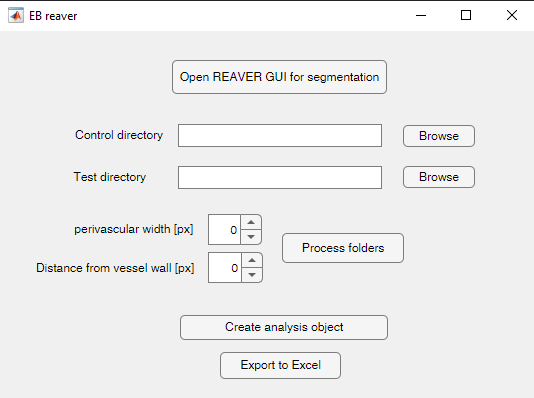
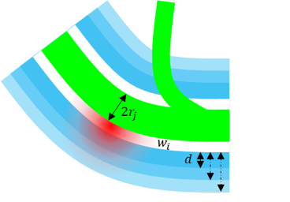
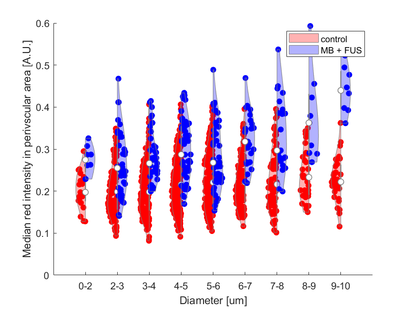
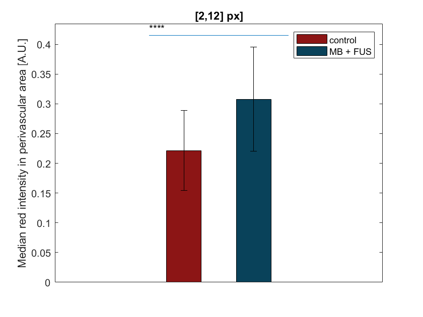
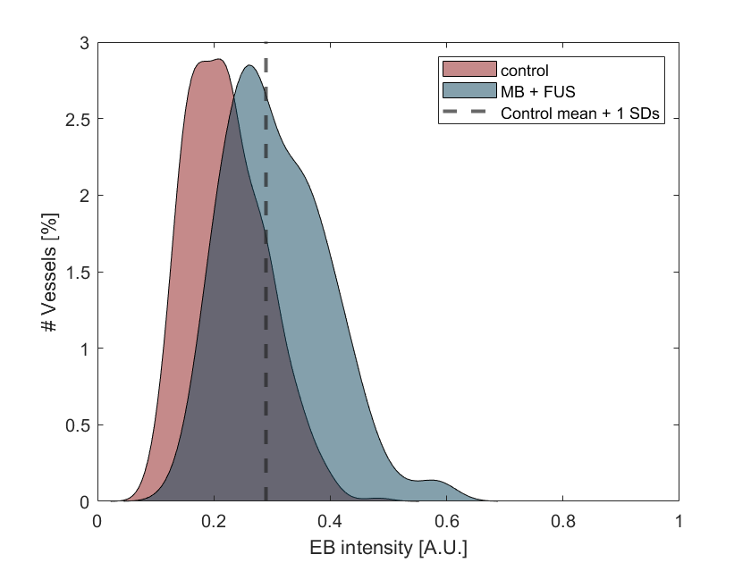
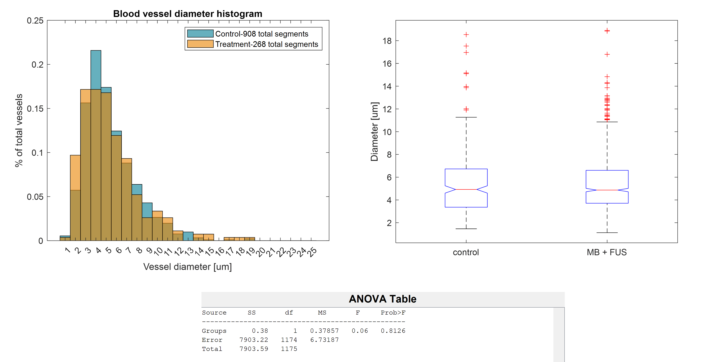
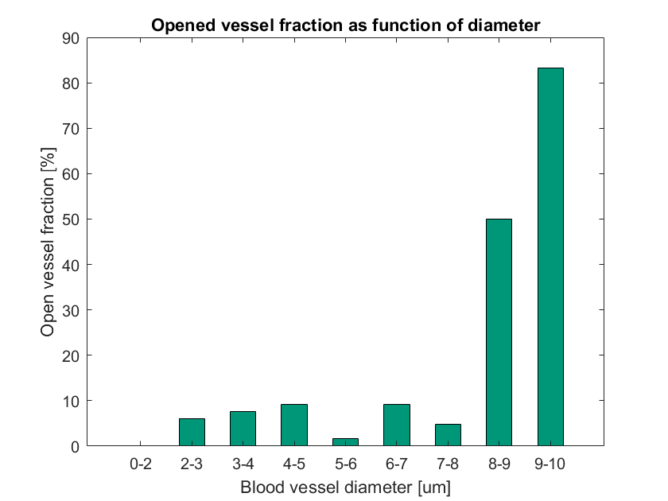

# REAVER for BBB opening
Rapid Editable Analysis of Vessel Elements Routine, utilized for quantification
of flurescent dye extravasation into the brain parenchyma during BBB opening.

## Dependencies:
* Tested on MATLAB 2021a, requires image processing toolbox.
* Before starting the process make sure the control and test tiff files are placed in seperate folders

## Example files
Try the pipeline on the *[Example files](https://github.com/TheIlovitshLab/EB_reaver/blob/master/Examples)*
 
# EB reaver Pipeline
## Initialization
1. Open the extracted folder in matlab and run the main app by executing:
	>BBBDreaverApp

in the MATLAB command terminal. 
The following window will pop-up:

## Vessel segmentation
1. Open the REAVER GUI via the dedicated push button
2. Follow the *[REAVER segmentation workflow](https://github.com/TheIlovitshLab/BBBDreaver/blob/master/REAVER%20GUI/REAVER%20GUI%20workflow.md)*
- Use the FITC-dextran (green) channl for segmentation
- This will create a ".mat" file for each segmented tiff file
- It will also create a "UserVerified.mat" file that points to verified files for future analysis

## Batch analysis of segmented images
1. Choose control file directory and test file directory.
- These should contain the already segmented tiff files
2. Specify the perivascular width (d) and the distance from vessel wall (w_i) to fit your experiment:

3. Press the process folders push button
- This will create an "Ext_analysis_<hyper_parameters>.mat" file in each of the directories
- The created file name indicated the analysis hyper-parameters

## Create a summary object
1. Press the "Create analysis object" push button
2. Choose the approperiate Ext_analysis file from the control directory
3. Choose the appropriate Ext_analysis file from the test directory
- This will generate a summary object of class "Ext_analysis" and save it to the open matlab workspace as "results"

## Summary Analysis
The Ext_analysis class object has the following plotting methods:

### violinplot
Implements a violin plot for control and test data side-by-side for the specified diameter groups.
>Bechtold, Bastian, 2016. Violin Plots for Matlab, Github Project
https://github.com/bastibe/Violinplot-Matlab, DOI: 10.5281/zenodo.4559847

### barplot
creates a bar plot for the specified diameter groups.
optional flag for which class groups to plot (1 = test, 2 = control and test, 0 = subtraction, -1 = control)

### markerDistrebution
Plots the distribution histogram of BBBD marker intensity in perivascular area for control and test groups.
The histograms are plotted seperately for each diameter group specified.
The histograms can be plotted with or without a line indicating the threshold for BBB opening classification
The histogram can be plotted as bar histogram or as 'psd' by applying a kernel density

### diamHist
Plots the histogram of diameters of all segmented vessels. Also adds a comparison (2-way ANOVA) between control and test distributions.

### openedHist
plots the fraction of opened vessels in different diameters of vessels (in specified diameter groups)
Also returns a table of opening percentage per frame and diameter for statistical analysis in GraphPad

## Other Ext_analysis class methods

### subarea
Create a new Ext_analysis object with vessels only from a user specified brain region

### writecsv
save to csv files for statistical analysis in external SW such as graphpad.
The data will be saved into 2 seperate CSV files, one for control and the
other for MB+FUS. Each row of the CSV represents a diameter group (e.g. 2-3) 
and each column represents the intensity of the BBBD marker dye (EB) around
a single vessel segment belonging to the diameter group.

### keep_diameters
Remove all vessels with diameters outside the specified thresholds

